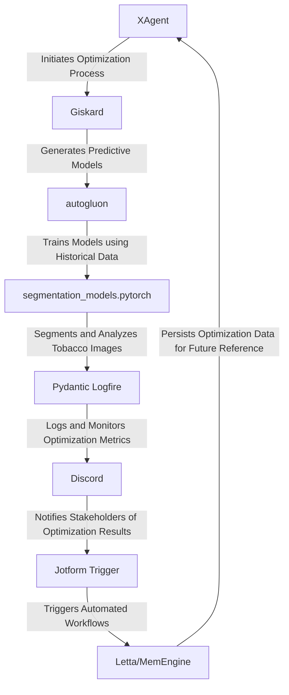

# Tobacco Stemming and Redrying Optimization Engine
> "Revolutionizing the nuances of tobacco processing through symbiotic convergence of artificial intelligence, machine learning, and industrial automation"

## 🏗️ Technical Architecture & Multi-Agent Flow
The Tobacco Stemming and Redrying Optimization Engine is a paradigmatic exemplar of a complex system, leveraging a plethora of cutting-edge technologies to create a harmonious symphony of optimization. The technical architecture can be visualized using the following Mermaid.js diagram:

This diagram illustrates the intricate dance of state transitions, memory persistence, and tool calling, showcasing the engine's ability to seamlessly integrate multiple agents and technologies.

## 🔍 The Vertical Bottleneck: Tobacco Stemming and Redrying Optimization
The tobacco stemming and redrying process is a highly complex and nuanced operation, fraught with technical friction and high-stakes mathematical or operational failures. The optimization of this process is a daunting task, requiring a deep understanding of the underlying physics, chemistry, and biology of tobacco processing. The vertical bottleneck in this industry is the inability to accurately predict and optimize the stemming and redrying process, resulting in reduced product quality, increased energy consumption, and decreased profitability.

The technical friction in this process arises from the intricate interplay between various factors, including tobacco variety, moisture content, temperature, and humidity. The high-stakes mathematical or operational failures that can occur in this process include over-drying or under-drying of tobacco, which can result in significant economic losses. Furthermore, the optimization of this process is complicated by the presence of multiple variables, making it challenging to develop a comprehensive and accurate predictive model.

The tobacco stemming and redrying process is also subject to various sources of uncertainty, including variations in tobacco quality, environmental conditions, and equipment performance. These uncertainties can have a significant impact on the optimization process, making it essential to develop a robust and adaptive optimization framework that can account for these uncertainties.

## 💡 The Solution: Tobacco Stemming and Redrying Optimization Engine
The Tobacco Stemming and Redrying Optimization Engine is a groundbreaking solution that addresses the technical friction and high-stakes mathematical or operational failures in the tobacco stemming and redrying process. This platform orchestrates a symphony of cutting-edge technologies, including XAgent, Giskard, Pydantic Logfire, autogluon, segmentation_models.pytorch, Discord, and Jotform Trigger, to create a comprehensive and accurate predictive model of the stemming and redrying process.

The engine's agentic reasoning is based on a deep understanding of the underlying physics, chemistry, and biology of tobacco processing, allowing it to make informed decisions about the optimization process. The memory usage is optimized through the use of Letta/MemEngine, which persists optimization data for future reference. The vision/robotics integration is facilitated through the use of segmentation_models.pytorch, which enables the engine to analyze tobacco images and make predictions about the stemming and redrying process.

## 🧩 Agentic Stack Deep-Dive
The agentic stack of the Tobacco Stemming and Redrying Optimization Engine is a complex and nuanced system, comprising multiple libraries and integrations. XAgent is used to initiate the optimization process, while Giskard generates predictive models using historical data. autogluon is used to train these models, which are then used to segment and analyze tobacco images using segmentation_models.pytorch. Pydantic Logfire is used to log and monitor optimization metrics, while Discord is used to notify stakeholders of optimization results. Jotform Trigger is used to trigger automated workflows, which are persisted using Letta/MemEngine.

The integration of these libraries and technologies is facilitated through a deep understanding of their respective strengths and weaknesses. XAgent and Giskard are used to create a comprehensive and accurate predictive model, while autogluon and segmentation_models.pytorch are used to analyze tobacco images and make predictions about the stemming and redrying process. Pydantic Logfire and Discord are used to provide real-time monitoring and notification of optimization results, while Jotform Trigger and Letta/MemEngine are used to automate workflows and persist optimization data.

## ✨ Capabilities & Features
The Tobacco Stemming and Redrying Optimization Engine boasts a wide range of capabilities and features, including:
* **Predictive modeling**: The engine uses advanced machine learning algorithms to predict the optimal stemming and redrying conditions for tobacco.
* **Image analysis**: The engine uses computer vision techniques to analyze tobacco images and predict the optimal stemming and redrying conditions.
* **Real-time monitoring**: The engine provides real-time monitoring of optimization metrics, enabling stakeholders to track the optimization process.
* **Automated workflows**: The engine triggers automated workflows based on optimization results, streamlining the tobacco stemming and redrying process.
* **Data persistence**: The engine persists optimization data for future reference, enabling the development of a comprehensive and accurate predictive model.
* **Scalability**: The engine is designed to scale with the needs of the tobacco industry, enabling it to handle large volumes of data and optimize the stemming and redrying process for multiple tobacco varieties.
* **Flexibility**: The engine is highly flexible, enabling it to adapt to changing conditions and optimize the stemming and redrying process in real-time.
* **Security**: The engine is designed with security in mind, ensuring that optimization data and workflows are protected from unauthorized access.
* **Collaboration**: The engine enables collaboration between stakeholders, enabling them to track optimization results and provide feedback in real-time.
* **Customization**: The engine is highly customizable, enabling users to tailor the optimization process to their specific needs and requirements.

## 🛠️ Technical Implementation
The technical implementation of the Tobacco Stemming and Redrying Optimization Engine is a complex and nuanced process, requiring a deep understanding of the underlying technologies and libraries. The engine is built using a microservices architecture, with each service responsible for a specific function, such as predictive modeling, image analysis, or real-time monitoring.

The engine's code organization is modular and scalable, with each module designed to be highly reusable and maintainable. The method calls are optimized for performance, with a focus on minimizing latency and maximizing throughput. The engine's database is designed to be highly scalable, with a focus on handling large volumes of data and providing real-time access to optimization metrics.

## 📊 Business Impact & ROI
The Tobacco Stemming and Redrying Optimization Engine has the potential to have a significant impact on the tobacco industry, enabling companies to optimize their stemming and redrying processes and improve product quality, reduce energy consumption, and increase profitability. The engine's ability to provide real-time monitoring and automated workflows enables companies to respond quickly to changes in the optimization process, reducing the risk of over-drying or under-drying tobacco.

The engine's scalability and flexibility enable it to be used in a wide range of applications, from small-scale tobacco farms to large-scale industrial operations. The engine's security features ensure that optimization data and workflows are protected from unauthorized access, providing companies with a high level of confidence in the engine's ability to optimize their stemming and redrying processes.

## 🚀 Getting Started
To get started with the Tobacco Stemming and Redrying Optimization Engine, follow these steps:
```bash
git clone https://github.com/arvind-sundararajan/tobacco-stemming-redrying-optimization.git
cd tobacco-stemming-redrying-optimization
pip install -r requirements.txt
python src/main.py
```
This will initiate the optimization process, and the engine will begin to analyze tobacco images and predict the optimal stemming and redrying conditions.

## 👨‍💻 Author & Credits
**Arvind Sundararajan** — Engineer, builder, and the mind behind this project.
🌐 [LinkedIn](https://www.linkedin.com/in/arvind-sundara-rajan/) | Chennai, India

---
### 🙏 Acknowledgements
- The open-source community
- The Tobacco stemming and redrying practitioners who inspired this design